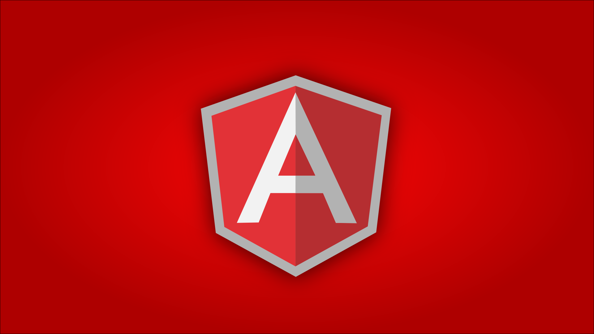

# Introducción

Hace unas semanas me encontraba buscando información sobre frameworks JavaScript del lado cliente (client-side) para desarrollar aplicaciones web. He de decir que los resultados al principio fueron apabullantes ya que la lista de este tipo de frameworks resultó ser muy larga: Backbone.js, Ember.js, Knockout, Agility.js, KendoUI y muchos más. Entre ellos estaba AngularJS, había visto un par de screencast sobre él, así que me decidí a estudiarlo más a fondo.



Después de un tiempo leyendo documentación, algún que otro libro y poniendo sobre el terreno lo aprendido de AngularJS, puedo decir que estoy gratamente sorprendido con él y que además, dará mucho de qué hablar de aquí en adelante.

## ¿Que es angularjs?

AngularJS es un framework JavaScript de desarrollo de aplicaciones web en el lado cliente, viene de la mano de los chicos de Google y se podría decir que utiliza el patrón MVC (Model-View-Controller).

Los creadores de este framework están convencidos de que HTML no está aún preparado para servir vistas dinámicas de un modo eficiente, así que han decidido extender la sintaxis de HTML para darle más funcionalidad.

## Modelo Vista Controlador en AngularJS

El patrón Modelo Vista Controlador se sigue en AngularJS, separando la parte visual de la funcionalidad y las estructuras de datos.

Entonces, ¿qué nos permite AngularJS?. Vamos a ver varios ejemplos donde intentaré explicar de pasada los puntos notables del framework. No obstante, me gustaría aclarar un par de conceptos que vais a ver continuamente en los ejemplos, los scopes y los controllers.

### Scopes

Los scopes son los distintos contextos de ejecución sobre los que trabajan las expresiones de AngularJS, por ejemplo, cuando referenciamos un atributo del modelo mediante la directive ng-model, no estamos sino apuntando a un atributo que contiene el scope sobre el que se está trabajando. En los scopes se guarda la información de los modelos que se representan en la vista y también atributos que se utilizan para manejar la lógica de la misma.

Los scopes se manejan principalmente desde los controllers y desde las directives.

### Controllers

Los controllers son los encargados de inicializar y modificar la información que contienen los scopes en función de las necesidades de la aplicación.

También podemos declarar funciones en el scope que se podrán utilizar más tarde o ser llamadas desde la vista.

El archivo HTML de la aplicación representa la vista y debe ser separada del controlador y el modelo.

El modelo es un objeto de JavaScript nombrado como elemento del controlador $scope. Contiene los datos a los que va a acceder la vista y deberá contener tambien métodos de acceso y modificación para separar totalmente la forma a la que se acceden o modifican los datos del controlador.

Para establecer un enlace bidireccional de datos entre la vista y el controlador: un cambio en la vista se refleja automáticamente en el controlador y viceversa. Veamos la sintaxis angular que usaremos:

- con `ng` indicamos a las etiquetas de la vista que van a llevar sintaxis de angular.

- `ng-app`: indica que nuestra aplicación es AngularJS.

- `ng-model`: define un modelo.

[Ejemplo del modelo-vista-controlador](../Ejemplos/clase 1/Index.html)

## ¿Que es Data-binding?

Data binding es un mecanismo mediante el cual podemos enlazar los elementos de la interfaz de usuario con los objetos que contienen la información a mostrar. El caso más típico de data binding es el enlazar un control de la interfaz de usuario con un valor o registro de una base de datos.

Ejemplos de Data-binding:

1. Utilizando la directiva ng-bind
```html
<p> Hello <span ng-bind="name"></span>! </p>
```

2. Sin utilizar la directiva ng-bind
```html
<p>
	Hello {{name}}!
</p>
```

## ¿Qué ofrece AngularJS?

__Client-side template__

El sistema de plantillas en AngularJS es diferente del utilizado en otros frameworks. Por lo general es el servidor el encargado de mezclar la plantilla con los datos y devolver el resultado al navegador. En AngularJS el servidor proporciona los contenidos estáticos (plantillas) y la información que se va a representar (modelo) y es el cliente el encargado de mezclar la información del modelo con la plantilla para generar la vista.

En el siguiente ejemplo se puede observar como representamos en AngularJS una lista de contactos utilizando el motor de plantillas y la directive ng-repeat, la cual nos permite iterar sobre el array para después mostrar uno a uno la información de cada elemento contenido en él.
